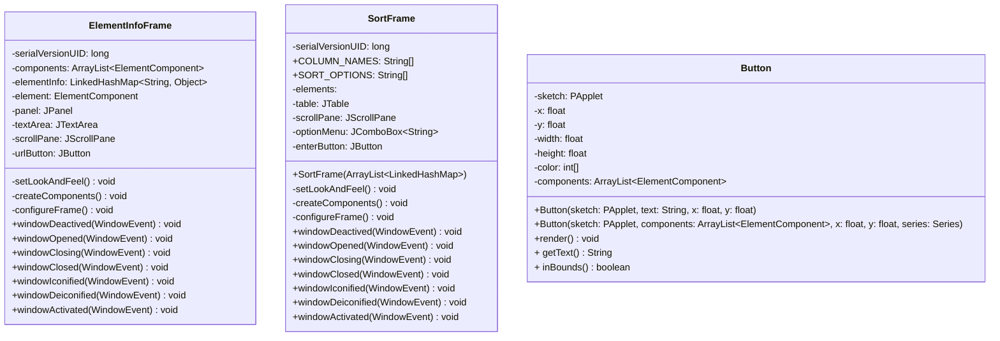

# cp2-individual-project

## 📝 Description

An interactive periodic table app that displays information about elements and sorts. Also comes with quiz games.

``` 
Year two programming concepts used:

> GUI controls - Processing and some Java
> Enhanced for loop
> Ternary statement
> Overloading
> IO and Exception Handling
> Collections (ArrayList, JSONArray, Set)
```

## 📚 Documentation





![Video of final running project]
[

## 🛠️ Installation Instructions

1. Go to [PeriodicTableProcessing/dist/PeriodicTable.jar](https://github.com/9661328/cp2-individual-project/blob/main/PerioidicTable/dist/Periodic%20Table.jar) and download the JAR file.
2. Run the file by double clicking it.


## 📸 Graphics

/screenshots here

## 🗒️ To-do: 

+ Create flowchart and class diagram.
+ Fix the documentation for the repository.
+ Upload screenshots or a video
+ Add repository to a portfolio.
