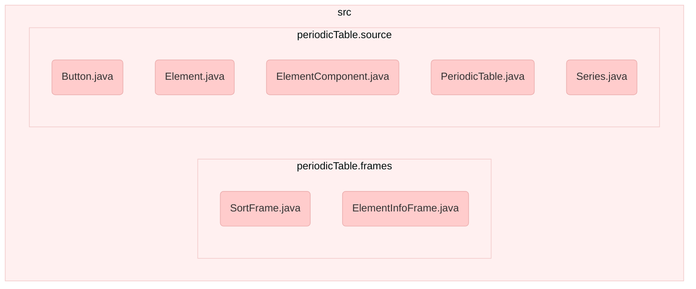
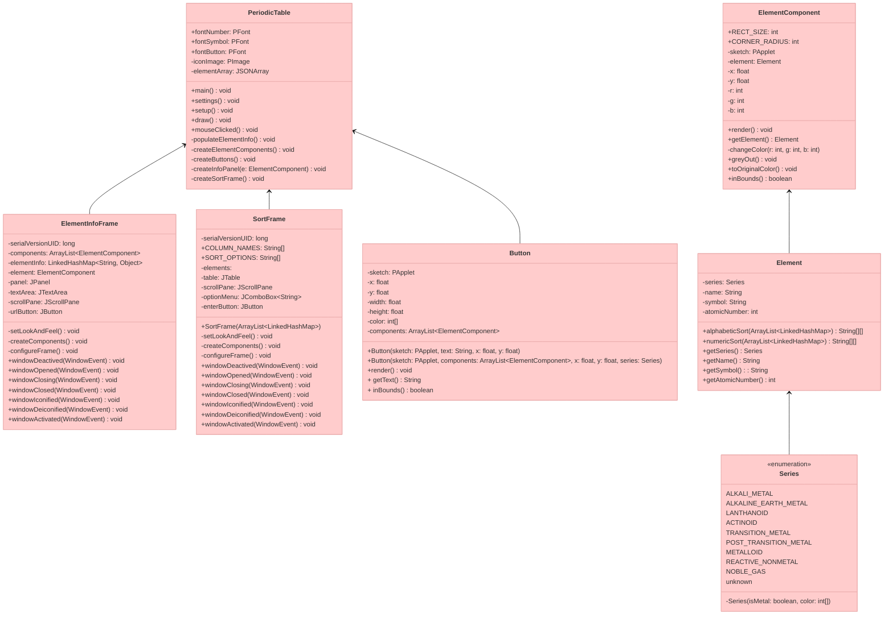

# cp2-individual-project

## 📝 Description

An interactive periodic table app that displays information about elements and sorts. Also comes with quiz games.

``` 
Year two programming concepts used:

> GUI controls - Processing and some Java
> Enhanced for loop
> Ternary statement
> Overloading
> IO and Exception Handling
> Collections (ArrayList, JSONArray, Set)
```

## 📚 Documentation

### Class diagram






![Possibly logic diagram]

## 🛠️ Installation Instructions

1. Go to [PeriodicTable/dist/PeriodicTable.jar](https://github.com/9661328/cp2-individual-project/blob/main/PeriodicTable/dist/PeriodicTable.jar) and download the JAR file.
2. Run the file by double clicking it[^1].

[^1]: On Mac, you may need to go to System Preferences > Security & Privacy and click "Open Anyway" if the file is being prevented from running.

## 📸 Graphics

/screenshots here

## 🗒️ To-do: 

- [ ] Create flowchart and class diagram.
- [ ] Fix the documentation for the repository.
- [ ] Upload screenshots or a video
- [ ] Add repository to a portfolio.
